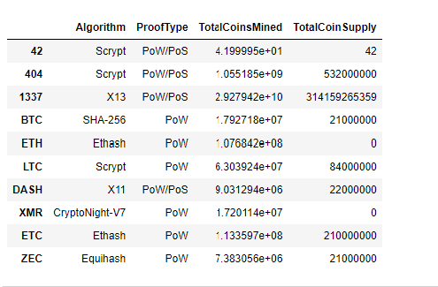

# Cryptocurrencies - Unsupervised Learning

User unsupervised learning to create a portfolio for the cryptocurrency market.

## Overview
The purpose of this analysis is to create a report for company called Accountability Accounting. They would like to know if they could add cryptocurrencies in their portfolio as part of their investment for their clients.  

Unsupervised machine learning methods:
- Data processing and transforming

- Clustering and utilizing K-means Algorithm 

- Visualization & classification with 2D and 3D scatter plots

## Resources 

- **Data Source:** [crypto_data_.csv](Resources/crypto_data.csv) was retrieved from [CryptoCompare](https://min-api.cryptocompare.com/data/all/coinlist)

- **Language, Tools & Libraries:** Python, Anaconda, Jupyter Notebook, Pandas  

## Results: 
The following results on this analysis is below. 

In the process and cleaning it is determined that there are 532 tradeable cryptocurrencies based on the data provided. 

### Crypto Dataframe after processing

### Dataframe with Three Principal Components after reducing Data Dimentions Using PCA.

### Finding the Best Value for k Using the Elbow Curve.

#### Clustered Dataframe before Visualization 

#### 3D-Scatter with PCA data and the Clusters

### Tradeable Dataframe of Cryptocurrencies using hvplot.table()

### New DataFrame that has scalled data with clustered_df DataFrame

### hvplot.scatter plot using x="TotalCoinsMined" and y="TotalCoinSupply"

## Summary: 
In summary, after processing, transforming, clustering and visualization there are 532 cryptocurrencies that are treadeable. These are divided into four classes per hvplot.scatter plot. These classes can be determined be determined by utility, payment, security and stablecoins. In this analysis, performance and potential rate of return for each cryptocurrency were not completed in order to provide recommendations to Accountability Accounting clients.  

